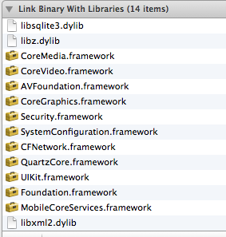

# Bee_Foundation

这是基础类库

## 外部依赖lib说明

## 升级到Xcode4.6后头文件<libxml/tree.h>找不到
http://stackoverflow.com/questions/1428847/libxml-tree-h-no-such-file-or-directory

1、项目-Target中的build phases，找到Link Binary With Libraries，点击“+” 添加 “libxml2.dylib”

2、同样的，切换到Buiild Settings的tab里，找到“Linking”选项框，在里面的"Other Linker Flags"的debug 和 release 里面点击“+”，添加 "-lxml2"

3、跟步骤2一样，找到 Framework Search 添加“/usr/lib/libxml2.dylib”；
在“Header Search Paths" 和 "User Header Search Paths” 里填入$(SDKROOT)/usr/include/libxml2。

然后clean项目，OK，可以使用了。
